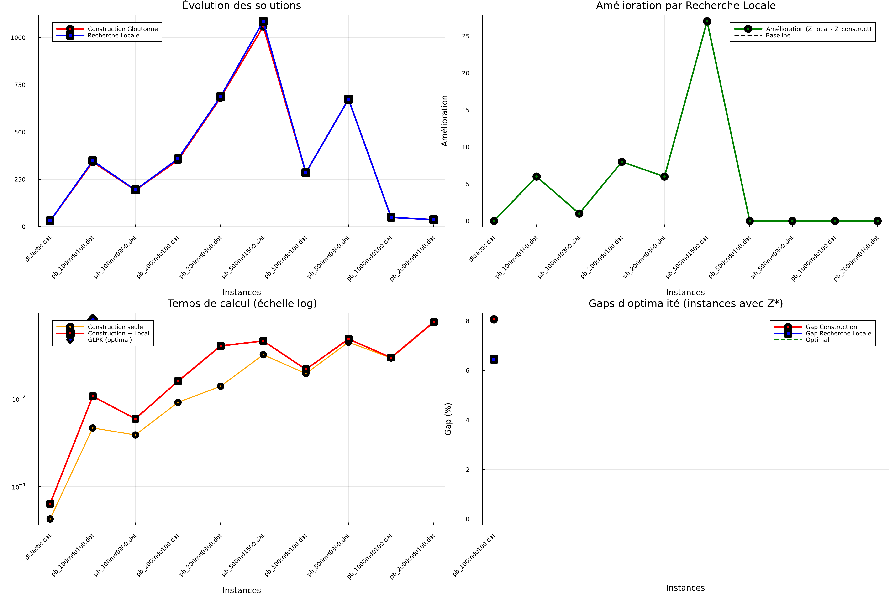
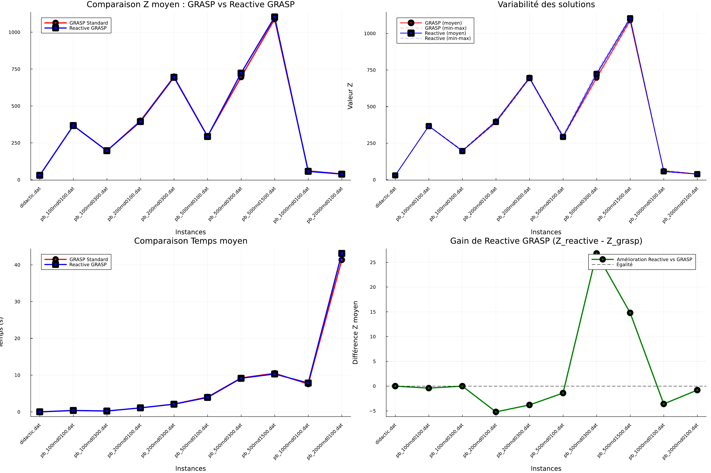

# MetaCode : Métaheuristiques pour le Set Packing Problem


Implémentation et comparaison de plusieurs métaheuristiques appliquées au **Set Packing Problem (SPP)**.

> Heuristique gloutonne, recherche locale, GRASP / Reactive GRASP, Algorithme Génétique, Colonies de fourmis (ACO), comparés sur 10 instances allant de 9 à 2000 variables, avec la solution exacte (GLPK) comme référence quand elle est atteignable.

---

## Sommaire

- [Le problème](#le-problème)
- [Méthodes implémentées](#méthodes-implémentées)
- [Structure du dépôt](#structure-du-dépôt)
- [Installation](#installation)
- [Utilisation](#utilisation)
- [Résultats](#résultats)
- [Auteurs](#auteurs)

---

## Le problème

Le **Set Packing Problem** est un problème d'optimisation combinatoire NP-difficile : sélectionner un sous-ensemble d'objets de valeur maximale, sous contrainte qu'aucun couple d'objets sélectionnés ne soit en conflit.

**Formulation :**

$$\max \sum_{j=1}^{n} c_j x_j \quad \text{s.c.} \quad \sum_{j=1}^{n} a_{ij} x_j \leq 1, \ \forall i \in \{1,\dots,m\}, \quad x \in \{0,1\}^n$$

Les instances sont au format OR-Library (`dat/`), de la petite instance didactique (`m=7, n=9`) jusqu'à `pb_2000rnd0100.dat` (`m=10000, n=2000`).

## Méthodes implémentées

| # | Méthode | Fichier | Idée clé |
|---|---|---|---|
| EI1 | **Heuristique gloutonne** | `src/Glouton.jl` | Construction itérative par ratio d'utilité $u_j = c_j / \sum_i a_{ij}$ |
| EI1 | **Recherche locale** | `src/Exploration.jl` | Voisinages 1-1 et 2-1 (échange retrait/ajout), descente simple (first-improvement) et profonde (best-improvement) |
| EI2 | **GRASP** | `src/Grasp.jl` | Construction gloutonne-randomisée via *Restricted Candidate List* (RCL), multi-start + recherche locale |
| EI2 | **Reactive GRASP** | `src/Grasp.jl` | Apprentissage en ligne du paramètre α de la RCL, par probabilités mises à jour selon la qualité moyenne obtenue |
| EI3 | **Algorithme Génétique** | `src/AG.jl` | Population + sélection par tournoi, croisement 2 points, mutation, réparation des solutions infaisables, hybridation mémétique (recherche locale périodique) |
| EI3 | **ACO (colonies de fourmis)** | `src/ACO.jl` | Construction guidée par phéromones + heuristique locale, alternance exploration/exploitation, perturbation anti-stagnation |
| -- | **Référence exacte** | `src/setSPP.jl`, `src/main.jl` | Modèle `JuMP` résolu par `GLPK` (solveur MILP exact, utilisé comme borne de comparaison sur les instances de taille raisonnable) |

Toutes les métaheuristiques réutilisent le même noyau de faisabilité (`peut_ajouter`, dans `Glouton.jl`) pour vérifier qu'une variable peut être ajoutée sans créer de conflit.

### RCL du GRASP

$$\text{RCL} = \{ j : u_j \geq u_{\min} + \alpha (u_{\max} - u_{\min}) \}$$

### Mise à jour du Reactive GRASP

$$p_k = \frac{q_k}{\sum_i q_i}, \qquad q_k = \frac{\bar z_k - z_{\text{worst}}}{z_{\text{best}} - z_{\text{worst}}}$$

Chaque valeur d'α reçoit une probabilité de sélection proportionnelle à la qualité moyenne des solutions qu'elle a produites.

### Phéromones de l'ACO

$$\tau_j \leftarrow \tau_j \cdot \rho_E + \rho_D \cdot [\, j \in \text{best\_iter} \,]$$

Évaporation globale puis dépôt sur la meilleure solution de l'itération, avec une perturbation anti-stagnation quand aucune amélioration globale n'a été trouvée depuis plusieurs itérations.

## Structure du dépôt

```
MetaCode/
├── src/
│   ├── loadSPP.jl        # lecture des instances
│   ├── setSPP.jl         # modèle JuMP exact du SPP
│   ├── getfname.jl       # utilitaire de listing de fichiers
│   ├── main.jl           # démo minimale : chargement + résolution exacte
│   ├── Glouton.jl        # EI1 : construction gloutonne + peut_ajouter + utilite_variable
│   ├── Exploration.jl    # EI1 : recherche locale (1-1, 2-1)
│   ├── Grasp.jl          # EI2 : GRASP + Reactive GRASP
│   ├── AG.jl             # EI3 : algorithme génétique
│   ├── ACO.jl            # EI3 : colonies de fourmis
│   └── experiments.jl    # scripts d'expérimentation complets (EI1 + EI2 + EI3), génère res/
├── dat/                  # 10 instances SPP
├── res/                  # tableaux LaTeX et graphiques générés par experiments.jl
│   └── img/               # versions PNG des graphiques (pour ce README)
├── doc/
│   └── rapport.tex       # rapport complet du projet
├── Project.toml          # dépendances Julia
└── LICENSE
```

## Installation

```bash
git clone https://github.com/<ton-pseudo>/MetaCode.git
cd MetaCode
julia --project -e 'using Pkg; Pkg.instantiate()'
```

## Utilisation

```julia
include("src/experiments.jl")

# EI1 : glouton + recherche locale sur les 10 instances (+ comparaison GLPK)
experimentationSPP()

# EI2 : GRASP vs Reactive GRASP (5 runs par instance)
experimentationSPP_EI2(n_runs=5)

# EI3 : GRASP vs ACO vs Algorithme Génétique (5 runs par instance)
experimentationSPP_EI3(n_runs=5)
```

Pour lancer un algorithme isolément :

```julia
include("src/loadSPP.jl")
include("src/Glouton.jl")
include("src/Exploration.jl")
include("src/Grasp.jl")

C, A = loadSPP("dat/pb_500rnd0100.dat")

x0 = construction_gloutonne(C, A)
x1 = descente_profonde(x0, C, A)

x_best, hist_construct, hist_improved, hist_best = grasp_complet(C, A, alpha=0.7, n_iter=100)
```

```julia
include("src/ACO.jl")
conf = precompute_conflicts(A)
best_sol, best_val = ACO_SPP(C, A, conf; maxIter=200, maxAnt=15)
```

```julia
include("src/AG.jl")
solution, fitness = algorithme_genetique_simple(C, A, taille_pop=100, generations=300)
```

## Résultats

### EI1 : Glouton + recherche locale

| Instance | m | n | Z* (GLPK) | T* (s) | Statut | Z glouton | T (s) | Gap % | Z + recherche locale | T (s) | Gap % | Speedup |
|---|---|---|---|---|---|---|---|---|---|---|---|---|
| `didactic.dat` | 7 | 9 | -- | -- | N/A | 30 | 0.0 | -- | 30 | 0.0 | -- | -- |
| `pb_100rnd0100.dat` | 500 | 100 | 372 | 0.64 | OPTIMAL | 342 | 0.0022 | 8.06 | 348 | 0.0114 | 6.45 | **×56.7** |
| `pb_100rnd0300.dat` | 500 | 100 | -- | -- | N/A | 193 | 0.0015 | -- | 194 | 0.0035 | -- | -- |
| `pb_200rnd0100.dat` | 1000 | 200 | -- | -- | N/A | 351 | 0.0083 | -- | 359 | 0.0251 | -- | -- |
| `pb_200rnd0300.dat` | 1000 | 200 | -- | -- | N/A | 682 | 0.0192 | -- | 688 | 0.1595 | -- | -- |
| `pb_500rnd1500.dat` | 1500 | 500 | -- | -- | N/A | 1059 | 0.1007 | -- | 1086 | 0.2073 | -- | -- |
| `pb_500rnd0100.dat` | 2500 | 500 | -- | -- | N/A | 285 | 0.0375 | -- | 285 | 0.0466 | -- | -- |
| `pb_500rnd0300.dat` | 2500 | 500 | -- | -- | N/A | 674 | 0.1939 | -- | 674 | 0.2291 | -- | -- |
| `pb_1000rnd0100.dat` | 5000 | 1000 | -- | -- | N/A | 49 | 0.0847 | -- | 49 | 0.0865 | -- | -- |
| `pb_2000rnd0100.dat` | 10000 | 2000 | -- | -- | N/A | 37 | 0.5496 | -- | 37 | 0.5572 | -- | -- |

Sur la seule instance résolue à l'optimum exact, la recherche locale ramène le gap de 8.06% à 6.45%, pour un temps de calcul environ **56 fois inférieur** à GLPK. Sur les instances plus grandes, GLPK n'a même pas été lancé (temps de résolution prohibitif) : seules les heuristiques passent à l'échelle.



### EI2 : GRASP vs Reactive GRASP (5 runs)

| Instance | m | n | GRASP Z min | GRASP Z max | GRASP Z moy | GRASP T (s) | Reactive Z min | Reactive Z max | Reactive Z moy | Reactive T (s) |
|---|---|---|---|---|---|---|---|---|---|---|
| `didactic.dat` | 7 | 9 | 30 | 30 | 30.0 | 0.0 | 30 | 30 | 30.0 | 0.0 |
| `pb_100rnd0100.dat` | 500 | 100 | 366 | 368 | 367.6 | 0.39 | 365 | 370 | 367.2 | 0.38 |
| `pb_100rnd0300.dat` | 500 | 100 | 195 | 203 | 196.6 | 0.24 | 195 | 203 | 196.6 | 0.23 |
| `pb_200rnd0100.dat` | 1000 | 200 | 399 | 403 | 399.8 | 1.09 | 387 | 403 | 394.6 | 1.09 |
| `pb_200rnd0300.dat` | 1000 | 200 | 693 | 703 | 698.6 | 2.12 | 689 | 699 | 694.8 | 2.09 |
| `pb_500rnd0100.dat` | 2500 | 500 | 289 | 300 | 294.8 | 4.03 | 285 | 305 | 293.4 | 3.91 |
| `pb_500rnd0300.dat` | 2500 | 500 | 681 | 714 | 696.4 | 9.23 | 711 | 739 | 723.2 | 9.16 |
| `pb_500rnd1500.dat` | 1500 | 500 | 1077 | 1111 | 1088.8 | 10.5 | 1097 | 1113 | 1103.6 | 10.31 |
| `pb_1000rnd0100.dat` | 5000 | 1000 | 54 | 67 | 60.6 | 7.58 | 54 | 59 | **57.0** | 7.86 |
| `pb_2000rnd0100.dat` | 10000 | 2000 | 39 | 40 | 39.6 | 41.37 | 37 | 40 | 38.8 | 43.12 |

Le Reactive GRASP égale ou dépasse le GRASP standard sur la majorité des instances (notamment `pb_1000rnd0100.dat` et `pb_200rnd0100.dat`), pour un coût en temps quasi identique : l'apprentissage en ligne du paramètre α ne coûte quasiment rien et paie souvent.



### EI3 : GRASP vs ACO vs Algorithme Génétique (5 runs)

| Instance | m | n | GRASP Z moy | GRASP σ | GRASP T (s) | ACO Z moy | ACO σ | ACO T (s) | AG Z moy | AG σ |
|---|---|---|---|---|---|---|---|---|---|---|
| `didactic.dat` | 7 | 9 | 30.0 | 0.0 | 0.00 | 30.0 | 0.0 | 0.00 | 30.0 | 0.0 |
| `pb_100rnd0100.dat` | 500 | 100 | 367.6 | 0.9 | 0.22 | **372.0** | 0.0 | 0.12 | 349.0 | 1.9 |
| `pb_100rnd0300.dat` | 500 | 100 | 196.6 | 3.6 | 0.15 | **203.0** | 0.0 | 0.09 | 194.0 | 0.0 |
| `pb_200rnd0100.dat` | 1000 | 200 | 399.8 | 1.8 | 0.89 | **404.2** | 9.1 | 0.25 | 354.0 | 3.7 |
| `pb_200rnd0300.dat` | 1000 | 200 | 698.6 | 4.4 | 1.68 | **707.8** | 7.5 | 0.63 | 686.2 | 2.5 |
| `pb_500rnd0100.dat` | 2500 | 500 | 294.8 | 5.0 | 4.42 | **307.2** | 2.8 | 0.59 | 285.0 | 0.0 |
| `pb_500rnd0300.dat` | 2500 | 500 | 696.4 | 11.7 | 9.68 | **741.0** | 8.6 | 1.30 | 674.0 | 0.0 |
| `pb_500rnd1500.dat` | 1500 | 500 | 1088.8 | 13.0 | 10.19 | **1132.4** | 23.6 | 1.34 | 1069.4 | 10.3 |
| `pb_1000rnd0100.dat` | 5000 | 1000 | 60.6 | 6.1 | 10.05 | 61.6 | 5.1 | 0.41 | 49.2 | 0.4 |
| `pb_2000rnd0100.dat` | 10000 | 2000 | 39.6 | 0.5 | 61.09 | 39.4 | 0.9 | 1.37 | **40.0** | 0.0 |

**Protocole :** 5 runs indépendants par algorithme et par instance. GRASP (α = 0.7, 100 itérations), ACO (15 fourmis, ρ = 0.8, 30 itérations, recherche locale intégrée), AG (population 80, 250 générations, croisement 0.9, mutation 0.02).

**Synthèse globale :**

| Métrique | GRASP | ACO | AG |
|---|---|---|---|
| Victoires (Z moy max, sur 10) | 1 | **8** | 1 |
| Temps moyen (s) | 19.94 | **0.71** | 57.47 |
| Écart-type moyen | 4.60 | 5.76 | **2.30** |
| Efficacité moyenne (Z/temps) | 18 536 | **98 654** | 2 947 |

**Ce que ça donne concrètement :**

- **ACO domine sur la qualité** (8 victoires sur 10) et sur la vitesse : temps quasi constant même sur `pb_2000rnd0100.dat` (n=2000), et converge vers une bonne solution en une poignée d'itérations grâce à la recherche locale intégrée à chaque construction.
- **GRASP** reste un compromis solide : qualité en 2e position, temps raisonnables, simple à implémenter et à paramétrer.
- **L'AG** est le plus robuste d'exécution en exécution (écart-type le plus faible, plusieurs instances à variance nulle) et reste compétitif sur les petites instances, mais son temps de calcul explose sur les grandes instances : 92.2 s sur `pb_1000rnd0100.dat` contre 0.41 s pour ACO (×224), et 395.8 s sur `pb_2000rnd0100.dat` contre 1.37 s pour ACO (×289). La population de 80 individus sur 2000 bits, combinée à la réparation systématique après chaque croisement/mutation, en est la cause principale.

> Note d'implémentation : `experimentationSPP_EI3()` (dans `src/experiments.jl`) reconstitue cette campagne : elle relance GRASP, ACO et l'AG (5 runs chacun) sur les 10 instances, régénère `res/tableau_EI3.tex` ainsi que `res/graphiques_EI3_synthese.pdf` (qualité, temps, robustesse, efficacité) et `res/graphiques_EI3_convergence.pdf` (courbes de convergence sur `pb_200rnd0300.dat`). Compte tenu des temps d'exécution de l'AG sur les grandes instances (plusieurs minutes chacun), l'exécution complète prend un certain temps, à lancer avec une bonne tasse de café.

## Auteurs

Projet réalisé par **NAIT SLIMANI Maroua**, **MOLLI Lila** et **ABID Ikram** dans le cadre du cours de Métaheuristiques.

`loadSPP.jl`, `setSPP.jl`, `getfname.jl` et la structure initiale de `main.jl` sont fournis par l'enseignant (Xavier Gandibleux) comme socle de départ du projet, voir `LICENSE`.

---

📄 Rapport complet : [`doc/rapport.tex`](doc/rapport.tex)
